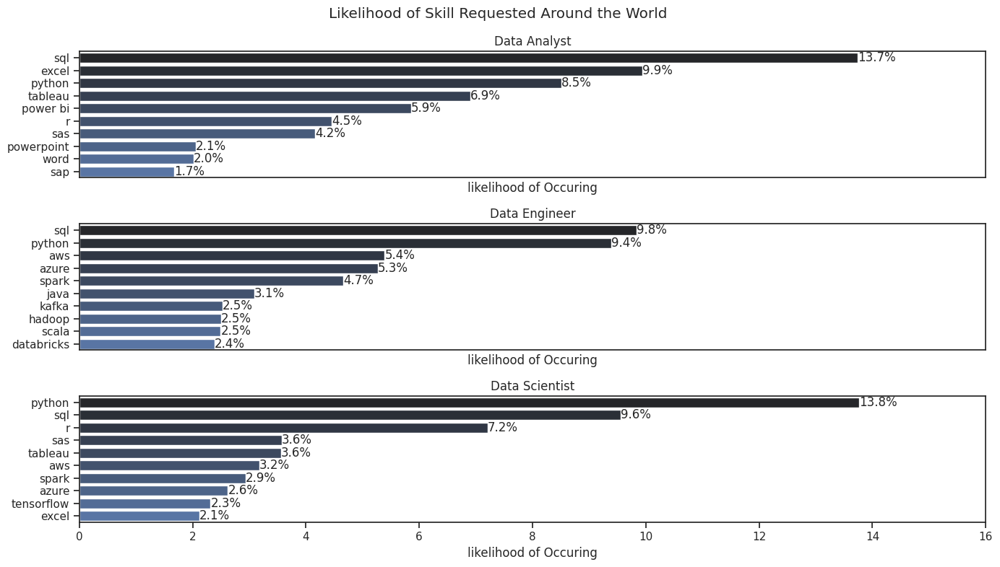
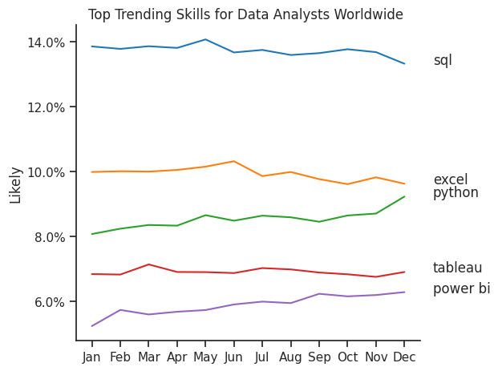
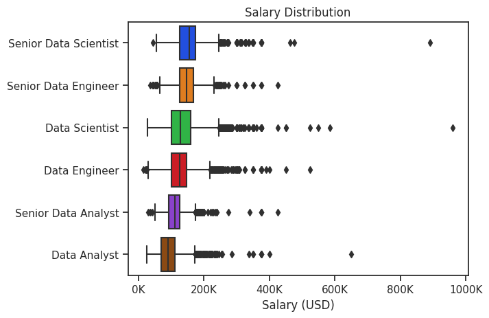

# The Analysis
## 1. What are most demanded skills for the top 3 most popular data roles?
Top find the most demanded skills:
1. **Organized Skills:** The list of skills for each job is expanded so each skill is counted separately.
2. **Counted Skills by Job Title:** Calculated how many times each skill is requested for specific job roles.
3. **Calculated Skill Popularity:** Finds the percentage of each skill within job titles to show which skills are most in-demand.
4. **Created a Visual:** Generates a chart that makes it easy to see the likelihood of each skill being requested for top job titles.

View my notebook with detailed steps here: [2_skill_count.ipynb](3_Projects/2_skill_count.ipynb)

**Python code**
```
top = 10
fig, ax = plt.subplots(len(job_titles), figsize=(14,8))
for i, title in enumerate(job_titles):
    data = df_percentage_count[df_percentage_count["job_title_short"].isin([title])].sort_values(by="count", ascending=False).head(top)
    sns.barplot(
        data = data,
        x="count_percentage",
        y="job_skills",
        ax=ax[i], 
        palette= "dark:b"
    )
    ax[i].set_title(title)
    ax[i].set_ylabel("")
    ax[i].set_xlabel("likelihood of Occuring")
    ax[i].set_xlim(0,16)
    v = data["count_percentage"]
    if i!=2:
        ax[i].set_xticks([])
    for n,(x,y) in enumerate(zip(data["count_percentage"],ax[i].get_yticks())):
        ax[i].text(x,y,f"{list(v)[n]:.01f}%", va="center")
fig.suptitle("Likelihood of Skill Requested Around the World ")
fig.tight_layout()
```
### Results


### Insights
1. **Data Analysts:** SQL, Excel, and Python are top skills, with SQL being the most demanded (13.7%). Skills like Tableau and Power BI are also prominent, reflecting the need for data visualization and analysis tools.

2. **Data Engineers:** SQL and Python are again highly sought-after (9.8% and 9.4%, respectively). Cloud and big data skills (AWS, Azure, Spark) are crucial for managing data infrastructure.

3. **Data Scientists:** Python dominates (13.8%), highlighting its importance in data science workflows. Other top skills include SQL, R, and machine learning frameworks (e.g., TensorFlow).

## 2. How are in-demand skills trending for Data Analysts?

### Visualization Data
```Python
fig, ax = plt.subplots()
sns.lineplot(data=df_plot, dashes=False, palette="tab10", ax=ax)
ax.set_title("Top Trending Skills for Data Analysts Worldwide ")
ax.set_ylabel("Likely")
ax.set_xlabel("")
ax.yaxis.set_major_formatter(lambda x,pos:f"{x}%")
plt.show()
```

### Results


### Insights

This line graph highlights the most popular skills among data analysts over a year, showing the trends in their usage:

- **SQL:** The most popular skill throughout the year, starting at 14% and peaking at 14.5% mid-year before a slight decline to 13.5% by December.
- **Excel:** Consistently popular, starting at 10% and ending at 10.5%, with minor fluctuations.
- **Python:** Shows steady growth, starting at 8% and rising to 8.5% by year-end, indicating increased demand.
- **Tableau:** Stable at around 6% throughout the year, with minor fluctuations.
- **Power BI:** Starts at 5.5% and rises slightly to 6% by December.

## 3. How well do jobs and skills pay for Data Analysts?
### Salary Analysis
#### Visualize Data
```
fig, ax = plt.subplots()
sns.boxplot(data=df_filtered, x="salary_year_avg", y="job_title_short", palette="bright", order=ordered_titles, ax=ax)
ax.set_title("Salary Distribution")
ax.set_ylabel("")
ax.set_xlabel("Salary (USD)")
ax.xaxis.set_major_formatter(lambda x,pos:f"{int(x/1000)}K")
plt.show()
```


The boxplot reveals the following key insights about salary distributions across various data roles:

1. Median Salaries: Seniority and specialization drive higher median salaries. Senior Data Scientists earn the most, followed by Senior Data Engineers and Data Scientists, while Data Analysts have the lowest median.

2. Salary Range and Variability: Senior Data Scientists and Data Scientists show the widest salary ranges, indicating significant variability likely due to factors like experience, industry, and location. Data Engineers and Senior Data Engineers also have wide ranges, though slightly less variable than Scientist roles. Data Analysts and Senior Data Analysts exhibit tighter, more consistent ranges.

3. Outliers: All roles have high outliers, especially Senior Data Scientists and Data Scientists, where salaries above $400,000 are observed, indicating that some individuals in these roles earn exceptionally high amounts.

4. Overall Trend: There is a clear trend where senior roles and specialized roles (Data Science and Data Engineering) earn higher salaries. In contrast, the Data Analyst roles are generally lower on the salary spectrum but show more consistency across employees.

In summary, seniority and specialization contribute to higher and more variable salaries, particularly in data science roles, while analyst roles have lower, more consistent pay.


### Highest Paid and Most in Demand Job Skills
#### Visualize Data
```
fig, ax = plt.subplots(2, figsize=(10,6))
sns.barplot(data=df_top_paying_skills, x="median", y=df_top_paying_skills.index,palette="dark:b", ax=ax[0])
ax[0].set_title("Top 10 Highest Paid Skills")
ax[0].set_ylabel("")
ax[0].set_xlabel("")
ax[0].xaxis.set_major_formatter(lambda x,pos: f"${int(x/1000)}K")

sns.barplot(data=df_top_skills, x="median", y=df_top_skills.index, palette="dark:b", ax=ax[1])
ax[1].set_title("Top 10 Most in Demand Skills")
ax[1].set_ylabel("")
ax[1].set_xlabel("")
ax[1].set_xticks(ax[0].get_xticks())
ax[1].xaxis.set_major_formatter(lambda x, pos: f"${int(x/1000)}K")
fig.tight_layout()
plt.show()
```


The visualization shows that the highest-paid skills are specialized and often niche (e.g., Debian, RingCentral, and Haskell), commanding nearly $200,000 due to their rarity. In contrast, the most in-demand skills, such as Spark, AWS, Python, and SQL, are widely applicable and crucial across industries but offer comparatively lower pay. This reflects a trend where emerging, less common technologies are highly compensated, while broadly useful tools are in high demand but less lucrative.
